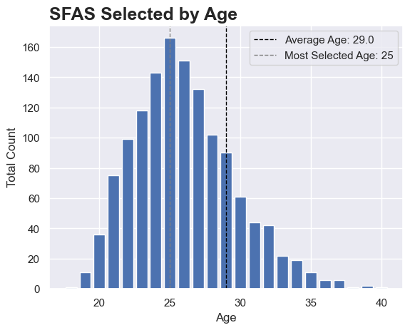
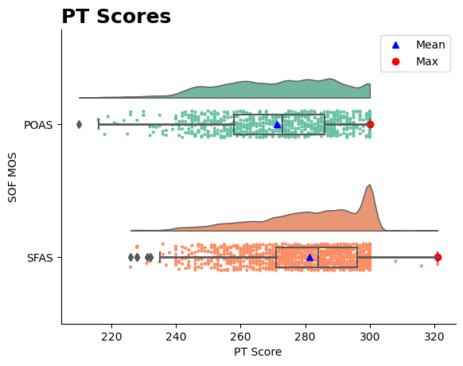
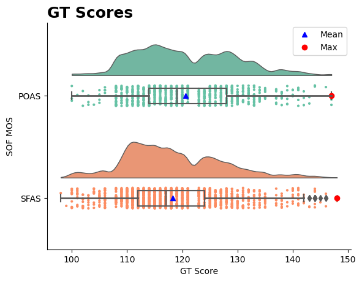
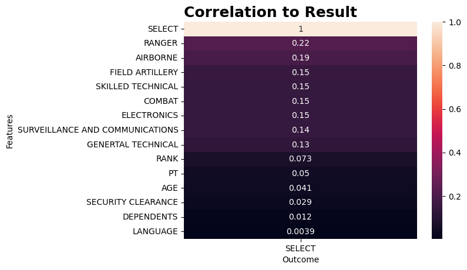

# Special Operations Forces Selection and Assessment
TO BE OR NOT TO BE SELECTED

***
 

## Table of Contents
- [Introduction](#introduction)
- [Data Processing](#data-processing)
- [Overview](#overview)
    - [Results by Age](#age)
    - [Key Features](#key-features)
- [Correlation](#correlation)
- [Hypothesis](#hypothesis)
    - [Distribution](#distribution)
    - [T-Test](#t-test)
 
 
 

***
## **Introduction**
***
This data is comprised of 12 different excel files spanning 6 years of selection and assesment results for the Special Operations (SOF) fields of Special Forces (SF) and Psychological Operations (PSYOP). The data is aggreted through a series of people from the application and selection process for these SOF fields.  
The following are the compiled and cleaned data files:  
[SFAS Excel File](/data/sfas/sfas.xlsx)
[POAS Excel File](/data/poas/poas.xlsx)
 
 
 

***
## **Data Processing**
***
Due to the aggregation process of this data, there were several human errors and difference in much of the data. Several steps where needed in the data cleaning process.

- 19 columns were removed
    - Personal Data: Personal Identifiable Information such as name, DOB, SSN's, etc were removed in order to not identify individuals as well as comply with Special Operations personal identity policies.
    - Additional columns were deemd unneeded for the purposes of this analyis. These columns were either additional non-identifiable personal information or information that related specifically to selection and not to the individuals attending selection
- Missing Information
    - Records no containing all information pertained to an individual were removed in order to non alter or skew the data
    - 16 POAS Records removed
    - 231 SFAS Records removed

***
## ***Overview***
***
 **Key Highlights**   
- **~2635** individuals attended POAS
    - 748 selected: **28.3%** Select Rate
    - Average Age: 
- **~8116** individuals attended SFAS
    - 1363 selected: **16.8%** Select Rate

    
    

    
    

 
 
 

### Age
 **Key Highlights**   
- POAS
    - Average age of **28.5**
- SFAS
    - Average age of **29**

    
    

 
 
 

### Key Features
 **Key Highlights**   
- POAS
    - PT Median score of **271**
    - GT Median score of **117**
    - CO Median score of **117**
- SFAS
    - PT Median score of **285**
    - GT Median score of **117**
    - CO Median score of **117**

- POAS CO Q3 matched that of SFAS at **124**

    
    
    

 
 
 

***
## ***Correlation***
***

 
 
 

***
## ***Hypothesis***
***
$H_O$: No single feature determines whether someone is selected  
$H_A$: Certain features determines whether someone is selected
 
 
 

### Distribution

### T-Test
T-Test conducted on features based on whether or not an individual was selected.

The following are the p-values with their corresponding feature:  
GT: **2.5269360674271627e-40**  
PT: **7.822031090768901e-09**  
AGE: **4.113012469721914e-06**  
LANG: **0.6882465259249742**  

<!-- GT Score Numbers
POAS 
Q1 - 111
Median - 117
Q3 - 126

SF
Q1 - 112
Median - 117
Q3 - 124

PT Score Numbers
POAS 
Q1 - 256
Median - 271
Q3 - 287

SF
Q1 - 271
Median - 285
Q3 - 297

CO Score Numbers
POAS 
Q1 - 109
Median - 117
Q3 - 124

SF
Q1 - 111
Median - 117
Q3 - 124 -->

